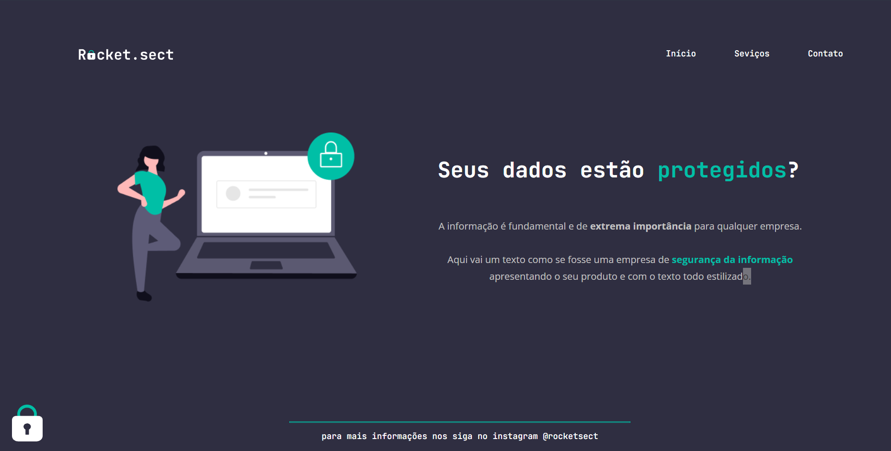

# Rocket.sect
Desafio do programa Explorer da Rocketseat. Recriação de um layout com todos os conhecimentos passados nas aulas de HTML e CSS

<h1 align="center">
  
</h1>

### Autor
---

<a href="#">
 
  
 
Lucas Alves
</a>
 
 

