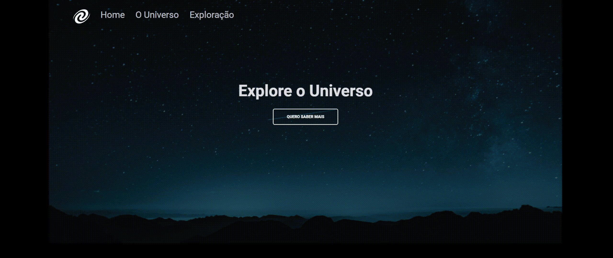

# SPA Universe

## 💻 Sobre o desafio

Criar uma página usando os conceitos aprendidos no Stage 06 do Explorer:

- Conceitos de SPA;
- Mapeamento de rotas;
- Assíncrono e promises;
- Orientação a objetos;
- Classes e muito mais.

A ideia agora é criar o **SPA Universe**! 🚀

Aqui está o [**link**](https://www.figma.com/file/m8zp3mtxvwyTGQs69nIFM8/%5BDesafios-Explorer%5D-SPA-Universe/duplicate) com o layout da aplicação.

## Preview

### Autor
---

<a href="#">
 
  
 
Lucas Alves
</a>
 
